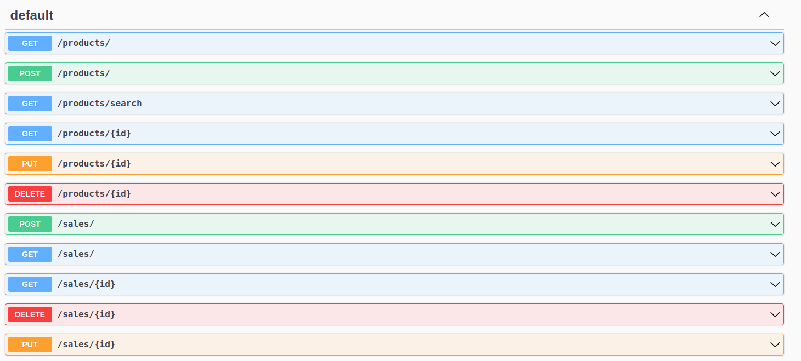
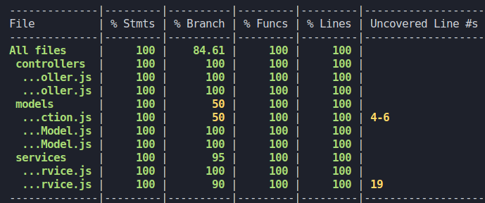

<h1 align="center"> Store Manager 📦 </h1>

## Sobre

Essa aplicação se trata de uma API no padrão REST, sendo um sistema de gerenciamento de vendas no formato dropshipping, sendo possível fazer o CRUD (create, read, update e delete) de produtos e vendas.
Além disso, o projeto segue um padrão de arquitetura MSC (model, service, controler) e TDD (desenvolvimento orientado por testes).

## Tecnologias utilizadas

> - Node.js
> - Express.js
> - MySql com MySql2
> - Mocha, Chai e Sinon
> - Joi
> - Docker
> - Swagger

## Rotas



## Cobertura de testes



## Rodando o projeto

```bash
git clone git@github.com:GabrielFerrariR/Store-Manager.git
cd Store-Manager/
npm install
npm start
```

Usando docker

```bash
docker-compose up -d
docker exec -it <container node> bash
npm install
npm run migration
npm run seed
npm start 
```
